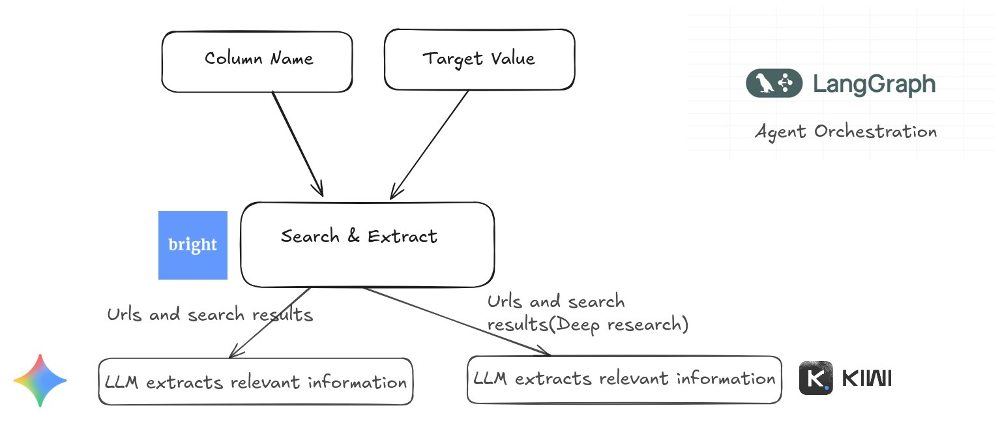

# brightdata-spreadsheet-enrichment


<div align="center">

  <p>Powered by <a href="https://brightdata.com">Bright Data</a></p>
</div>

## 🚀 Welcome to the Spreadsheet Enrichment Repository!

An end-to-end solution for building AI-enriched spreadsheets with real-time web access. The application combines [Bright Data's](https://brightdata.com/) advanced web scraping and search capabilities with AI foundation models to transform your business spreadsheets with intelligent web-sourced information.


## Features

With this application, you can:
- 📊 Enrich spreadsheet cells with AI-generated content backed by live web data
- 🧠 Entity extraction and data processing with advanced LLMs
- 🔄 Process entire columns in batch for efficient data enhancement
- 📑 Access source citations for all web-sourced information
- 📂 Export your enriched data as CSV files for further use
- 🔍 Deep research mode with comprehensive multi-source verification

Designed for ease of customization, you can extend this core implementation to:
- Integrate proprietary data sources
- Modify the agent architecture
- Configure different AI foundation models
- Perform advanced web scraping and data extraction using Bright Data's comprehensive toolkit

## Architecture Diagram


## Setup Instructions

#### API Keys:

This application requires API keys from the following services:
- [Bright Data API](https://brightdata.com/)
- [Google Gemini API](https://ai.google.dev/) (for LLM processing)
- [OpenRouter API](https://openrouter.ai/) (optional, for deep research mode)

#### Set up environment variables:

   a. Create a `.env` file in the project's root directory with your API keys:
   ```bash
   BRIGHT_DATA_API_TOKEN=<your Bright Data API token>
   WEB_UNLOCKER_ZONE=<your web unlocker zone (default: unblocker)>
   BROWSER_ZONE=<your scraping browser zone (default: scraping_browser)>
   GOOGLE_API_KEY=<your Google Gemini API key>
   OPENROUTER_API_KEY=<your OpenRouter API key (optional, for deep research)>
   ```

   b. Create a `.env.development` file in the `ui` directory with:
   ```bash
   VITE_API_URL=http://localhost:8000
   VITE_WS_URL=ws://localhost:8000
   ```

### Backend Setup
#### Python Virtual Environment
1. Create a virtual environment and activate it:
```bash
python3.11 -m venv venv
source venv/bin/activate  # On Windows: .\venv\Scripts\activate
```

2. Install dependencies:
```bash
python3.11 -m pip install -r requirements.txt
```

3. From the root of the project, run the backend server:
```bash
python app.py
```
#### Docker 

1. Alternatively, build and run the backend using Docker from the root of the project:
```bash
# Build the Docker image
docker build -t brightdata-spreadsheet .

# Run the container
docker run -p 8000:8000 --env-file .env brightdata-spreadsheet
```

### Frontend Setup

1. Navigate to the frontend directory:
```bash
cd ui
```

2. Install dependencies:
```bash
npm install
```

3. Start the development server:
```bash
npm run dev
```
4. Launch the app in your browser with http://localhost:5174/

## 📂 Repository Structure

This repository includes everything required to create a functional spreadsheet enrichment tool with web access:

### 📡 Backend ([`backend/`](./backend))
The core backend logic, powered by LangGraph and Bright Data MCP:
- [`graph.py`](./backend/graph.py) – Defines the agent architecture, state management, and processing nodes using Bright Data's web scraping capabilities.

### 🌐 Frontend ([`ui/`](./ui))
Interactive React frontend for dynamic user interactions and spreadsheet responses.

### Server
- [`app.py`](./app.py) – FastAPI server that handles API endpoints and orchestrates the enrichment pipeline.

## Tech Stack

- **Bright Data MCP**: Advanced web scraping and data collection through Model Context Protocol
- **LangGraph**: Agent workflow orchestration and state management
- **FastAPI**: High-performance API backend
- **React**: Interactive frontend interface
- **AI Models**: Intelligent data processing and extraction

## Research Modes

### Standard Mode
- Fast, efficient web search and data extraction
- Single-source verification
- Optimized for speed and basic enrichment tasks

### Deep Research Mode
- Multi-source verification across 3+ independent sources
- Authority prioritization: LinkedIn profiles, company pages, press releases
- Iterative refinement with 5-7 search iterations
- Advanced browser automation for complex sites
- Comprehensive fact-checking and validation

## API Endpoints

- `POST /api/enrich/batch`: Endpoint that handles batched agent execution and spreadsheet population.
- `GET /api/health`: Health check endpoint.

## Contributing

Feel free to submit issues and enhancement requests!

## 📞 Contact Us

Have questions, feedback, or looking to build a custom solution? We'd love to hear from you!

- Email our team directly for support and customization requests
